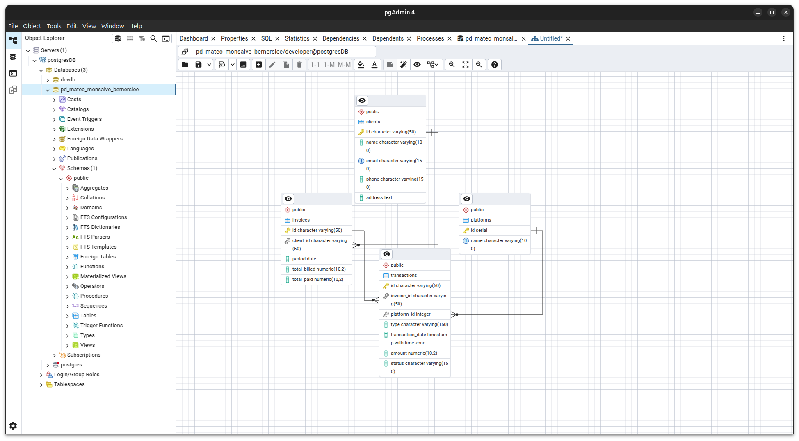

# Financial Management System

## System Description

This project is a solution to organize and structure financial information from Fintech platforms like Nequi and Daviplata. The system allows loading, storing, and managing this information in a SQL database, providing a CRUD system and key queries to meet the client's needs.

## Instructions to run the project

### Prerequisites

- Node.js (v14 or higher)
- npm (v6 or higher)
- PostgreSQL (or any other SQL database)

### Backend

1.  Navigate to the `backend` directory:
    ```bash
    cd backend
    ```
2.  Install the dependencies:
    ```bash
    npm install
    ```
3.  Start the server:
    ```bash
    npm start
    ```

### Frontend

1.  Navigate to the `frontend` directory:
    ```bash
    cd frontend
    ```
2.  Install the dependencies:
    ```bash
    npm install
    ```
3.  Start the client:
    ```bash
    npm run dev
    ```

## Technologies used

### Backend

-   **Node.js:** JavaScript runtime environment
-   **Express:** Web framework for Node.js
-   **pg:** PostgreSQL client for Node.js
-   **cors:** Middleware for enabling CORS
-   **multer:** Middleware for handling `multipart/form-data`
-   **csv-parser:** Library for parsing CSV files

### Frontend

-   **Vite:** JavaScript vainilla bundler and easy application runner

### Database

-   **PostgreSQL:** Object-relational database system

## Normalization Explanation

The database schema was designed following the first three normal forms (1FN, 2FN, 3FN) to reduce data redundancy and improve data integrity.

-   **1FN:** Each table has a primary key, and all attributes contain atomic values.
-   **2FN:** All non-key attributes are fully functional dependent on the primary key.
-   **3FN:** All attributes are dependent only on the primary key, not on other non-key attributes.

## Instructions for mass loading from CSV

The system allows mass loading of data from CSV files through a frontend interface.

1.  Go to the "Clients" section in the dashboard.
2.  Click on the "Upload Clients" button.
3.  Select the CSV file with the clients' data.
4.  The data will be loaded into the database.
5.  Be sure that there is not any client loaded before with the same data of the csv file.

This process can be extended to other entities like invoices, platforms, and transactions by creating similar interfaces.

## Advanced Queries Explanation

The system includes the following advanced queries to meet the client's needs:

1.  **Total paid by each client:** This query calculates the total amount paid by each client, allowing for income control and general balance verification.
2.  **Pending invoices with associated client and transaction information:** This query identifies invoices that have not been fully paid, along with the client's name and the corresponding transaction, to manage collections or follow-ups.
3.  **List of transactions by platform:** This query allows viewing all transactions made from a specific platform (like Nequi or Daviplata), including which client they belong to and which invoice they are paying.

## Relational Model Capture




## Developer Data

-   **Name:** Mateo Monsalve
-   **Clan:** Berners-Lee
